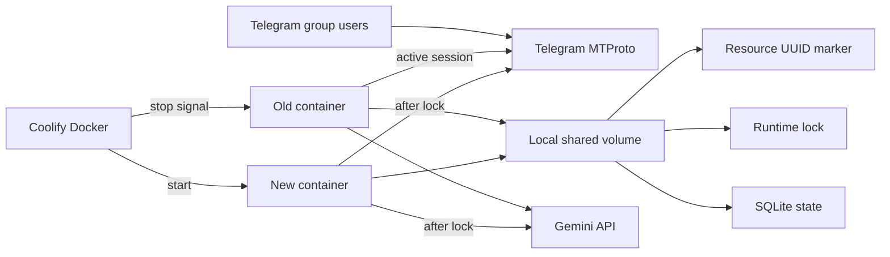

# Threat model: container handover и graceful shutdown

## Executive summary

Наиболее существенные риски незакоммиченного изменения связаны не с удалённым захватом приложения, а с доступностью и целостностью состояния во время Coolify rolling deployment: одновременным запуском двух swarm-runtime и принудительным `SIGKILL` до завершения cleanup. Текущий diff переводит оба пути в fail-closed/bounded режим: production mount связан с Coolify resource marker до SQLite/Telegram, а worst-case cleanup ограничен примерно 13 секундами при обязательном platform grace 60 секунд. После production-миграции marker/grace, подтверждения single-host local volume и исключения Coolify host/admin из модели угроз максимальный остаточный приоритет — **low**.

## Scope and assumptions

В scope входят незакоммиченные изменения lifecycle и непосредственно связанные runtime-пути:

- `run.py`, `core/runtime_lock.py`, `core/runtime_volume.py`, `core/persistence.py`;
- `userbot/swarm_manager.py`, `userbot/client.py`;
- `ai/history.py`, `userbot/exchange_store.py`;
- `Dockerfile`, production-инструкции в `README.md` и соответствующие тесты/specs.

Вне scope: полный аудит Telegram reply-routing, prompt injection/Gemini output safety, CI/CD supply chain, исходный код Coolify/Docker/Telegram/Gemini и компрометация production host.

Подтверждённые пользователем assumptions:

- `/app/data` — локальный Docker volume или bind mount на одном Coolify host;
- volume совместно используют только сменяющие друг друга old/new containers;
- иных процессов или сервисов с правом записи в volume нет;
- Coolify host и его администратор доверенные и находятся вне attacker model;
- история содержит пользовательский контент Telegram, но для этого lifecycle-review не предполагается отдельная категория регулируемых данных.

Открытых вопросов, меняющих текущую оценку lifecycle-рисков, нет. Переход на NFS, добавление постоянной второй replica или стороннего writer потребуют пересмотра модели.

## System model

### Primary components

- Coolify/Docker создаёт новый container, посылает старому `SIGTERM` и после stop grace period может завершить его принудительно. `Dockerfile` задаёт `STOPSIGNAL SIGTERM`, а `run.main` устанавливает async handlers. Production contract требует Coolify Stop Grace Period 60 секунд.
- `RuntimeVolumeGuard` до handover/lock/SQLite/Telegram проверяет `/app/data` по Linux mount table и связывает regular marker с непустым `COOLIFY_RESOURCE_UUID` без автоматического создания или логирования значения (`core/runtime_volume.py:RuntimeVolumeGuard`).
- `RuntimeInstanceLock` координирует old/new containers через regular lock-файл рядом с SQLite и удерживает Linux `flock` до завершения cleanup (`core/runtime_lock.py:22`, `run.py:779`).
- `RuntimeContext` владеет двумя `aiosqlite` connections: message history и scheduled exchange state (`run.py:32`, `ai/history.py:269`, `userbot/exchange_store.py:471`).
- `SwarmManager` запускает и параллельно отключает Telethon clients; каждый stop имеет deadline 5 секунд, SQLite resources закрываются параллельно с deadline 3 секунды; session strings поступают из environment-backed settings (`userbot/swarm_manager.py:SwarmManager`, `run.py:_close_runtime_resources`).
- Telegram, proxy и Gemini остаются внешними сетевыми зависимостями active runtime; новый container не должен обращаться к ним до получения runtime lock.

### Data flows and trust boundaries

- Coolify/Docker → container PID 1: lifecycle signals через Linux process boundary; доверенный operator plane, обработка `SIGTERM`/`SIGINT`, внешний hard limit задаётся stop grace period.
- Environment/TOML → Python process: API credentials, Telethon session strings, proxy URL и operator configuration; Pydantic запрещает неизвестные TOML fields и валидирует обязательные значения (`core/config.py:30`, `core/config.py:81`).
- Old/new containers → shared volume: resource marker, lock PID, SQLite messages и scheduled state через local filesystem; оба container работают как UID `10001`, guard требует общий resource marker, а kernel `flock` разрешает активное владение только одному (`core/runtime_volume.py`, `core/runtime_lock.py`).
- Active runtime → Telegram/proxy: Telethon MTProto sessions и пользовательские сообщения; TLS/MTProto обеспечиваются внешней библиотекой, lifecycle code отвечает только за отсутствие параллельного использования одной session.
- Active runtime → Gemini: prompts и message context через внешний API; эта граница отмечена для полноты, но prompt/output controls не входят в данный diff-review.

#### Diagram

## Assets and security objectives

| Asset | Why it matters | Security objective (C/I/A) |
|---|---|---|
| Telethon session strings | Компрометация позволяет действовать от имени Telegram accounts | C, I |
| Telegram message history | Содержит пользовательский контент и anti-repeat context | C, I, A |
| `scheduled_exchanges` state | Определяет расписание, повторы и состояние orchestrator | I, A |
| Exclusive runtime ownership | Предотвращает двойные ответы и одновременное использование sessions | I, A |
| Coolify lifecycle configuration | Определяет доставку signal и время для cleanup | I, A |
| Lifecycle logs | Нужны для обнаружения overlap, timeout и незавершённого cleanup | I, A |

## Attacker model

### Capabilities

- Удалённый участник целевой Telegram group может создавать обычный message traffic во время deployment.
- Telegram, proxy или Gemini могут быть временно недоступны либо медленно завершать сетевые операции.
- Ошибка operator configuration может сократить stop grace period, изменить mount или случайно запустить постоянную вторую replica.
- Старый и новый containers кратковременно существуют одновременно и имеют одинаковый UID и доступ к одному volume.

### Non-capabilities

- Удалённый Telegram user не может выбирать `db_path`, создавать файлы в `/app/data` или отправлять Unix signals container.
- Посторонних writers shared volume нет.
- Coolify host/admin не считаются атакующим; их компрометация даёт более сильные возможности, чем защищает runtime lock.
- NFS/network filesystem и multi-host deployment не используются.

## Entry points and attack surfaces

| Surface | How reached | Trust boundary | Notes | Evidence (repo path / symbol) |
|---|---|---|---|---|
| `SIGTERM`/`SIGINT` | Coolify/Docker или operator | Host control plane → process | Переводятся в `asyncio.Event` до startup | `run.py:_install_signal_handlers` |
| Volume identity | Coolify environment и `/app/data` | Deployment config → shared volume | Mountinfo + regular non-symlink marker; fail-closed до runtime lock | `core/runtime_volume.py:RuntimeVolumeGuard.verify` |
| Runtime lock path | Производная от trusted `settings.db_path` | Process → shared volume | `O_NOFOLLOW`, regular-file check, `0600`, bounded wait | `core/runtime_lock.py:RuntimeInstanceLock.acquire` |
| SQLite bootstrap | Process startup | Process → shared volume | Два connections, busy timeout и retry только lock errors | `run.py:_build_runtime_context`; `core/persistence.py` |
| Telethon startup/stop | Active swarm lifecycle | Container → Telegram/proxy | Partial/registered cleanup имеет per-client deadline и best-effort stop всех clients | `userbot/swarm_manager.py:_start_single_bot`; `SwarmManager._stop_client` |
| Operator secrets/config | Environment и TOML | Deployment config → process | Secrets не должны попадать в repo/logs | `core/config.py:Secrets`; `SwarmBotRuntimeConfig` |
| Telegram message traffic | Target group | Internet → active client | Может совпасть по времени с shutdown; content-security вне scope | `userbot/client.py:run_until_disconnected` |

## Top abuse paths

1. Operator подключает пустой или другой volume к новому container → mount/marker validation не проходит → startup завершается до lock/SQLite/Telegram и не создаёт параллельный runtime. Обход требует осознанно скопировать правильный marker или контролировать trusted deployment plane.
2. Telegram/SQLite cleanup зависает → per-resource deadlines ограничивают внутренний worst-case примерно 13 секундами → при Coolify grace 60 секунд процесс успевает освободить runtime lock; platform misconfiguration ниже этого budget остаётся внешним fail condition.
3. Старая replica не получает signal или зависает → продолжает удерживать `flock` → новый container ждёт 60 секунд и завершается → deployment остаётся без новой active replica, но не запускает две одновременно.
4. Процесс с доступом к volume подменяет lock path symbolic link → startup пытается открыть чужой файл → текущая реализация отклоняет link до truncate, поэтому путь заканчивается контролируемым отказом запуска.
5. SQLite writer остаётся активным во время shutdown → bootstrap нового container получает `database is locked` → bounded busy timeout и retry позволяют пережить краткий overlap, а затем завершают startup с явной ошибкой.
6. Deployment переносится на NFS без пересмотра → POSIX advisory locking работает несовместимо → оба runtime могут считать себя владельцами; подтверждённая production topology исключает этот путь сейчас.

## Threat model table

| Threat ID | Threat source | Prerequisites | Threat action | Impact | Impacted assets | Existing controls (evidence) | Gaps | Recommended mitigations | Detection ideas | Likelihood | Impact severity | Priority |
|---|---|---|---|---|---|---|---|---|---|---|---|---|
| TM-001 | Operator misconfiguration | Old/new containers получают разные volumes или запускается replica с другим lock path | Попытка обойти exclusive ownership и запустить параллельный Telegram/SQLite runtime | Двойные сообщения, session conflicts, lock errors | Runtime ownership, Telegram sessions, SQLite state | Fail-closed mountinfo + resource marker до lock/SQLite/Telegram (`core/runtime_volume.py`); lock до внешних connections (`run.py:_run_application`) | Trusted admin может скопировать корректный marker; marker/grace migration обязательна до первого deploy | Закрепить один storage destination `/app/data`, не копировать marker между resources, replicas = 1 | Alert на volume validation failure или два лога `Runtime lock получен`; Telegram duplicate-response metric | very low | high | low |
| TM-002 | Platform timeout or slow cleanup | Stop grace меньше internal budget либо platform принудительно завершает process | Docker посылает `SIGKILL` до завершения lifecycle | Краткая недоступность, SQLite recovery, незавершённая отправка | Availability, SQLite state, sessions | 5 s per-client timeout, concurrent registered client stop, 3 s parallel SQLite close, cleanup order (`SwarmManager._stop_client`; `run.py:_close_runtime_resources`) | Приложение не может проверить Coolify UI field | Установить Coolify Stop Grace Period 60 s; alert на exit code 137 и отсутствие финального lifecycle log | Проверять `docker stop --time=60` и последовательность `SIGTERM` → client stop → SQLite close → lock release | low | medium | low |
| TM-003 | Local volume writer | Нужен write-доступ к `/app/data`; по подтверждённой topology такого недоверенного субъекта нет | Подмена lock path link или special file | Повреждение другого файла либо startup DoS | Host-visible app files, availability | `O_NOFOLLOW`, `fstat` regular-file check, `fchmod 0600` (`core/runtime_lock.py:47`) | Parent directory остаётся доверенной частью volume | Сохранять volume доступным только UID приложения; не монтировать недоверенные каталоги | Alert на `ELOOP`/`EINVAL` при startup; audit неожиданных file types | low | medium | low |
| TM-004 | Stale or hung old runtime | Старый process жив и удерживает lock дольше 60 s | Блокирует запуск новой версии | Deployment outage без split-brain | Availability | Bounded wait и fail-closed до SQLite/Telegram (`RuntimeInstanceLock.acquire`) | Автоматический restart может повторять цикл | Coolify health/restart policy должна эскалировать repeated lock timeout оператору, а не бесконечно плодить containers | Count lock-wait timeout и active container count | low | medium | low |
| TM-005 | Internal concurrency or abrupt cancellation | Незавершённый SQLite write совпадает с bootstrap/cleanup | Удержание SQLite writer lock и повторные `SQLITE_BUSY` | Задержка startup, пропуск текущего exchange; corruption маловероятна при корректном local FS | Message history, scheduled state, availability | 10 s busy timeout, bounded retry, best-effort close preserving original error (`core/persistence.py`; `run.py:_build_runtime_context_once`) | Нет transaction-duration metrics | Измерять длительные writes и bootstrap retries; сохранять короткие transactions | Alert на повторный `database is locked` после исчерпания retries | low | medium | low |
| TM-006 | Unsupported storage topology | Volume переводится на NFS/network FS или multi-host | Несовместимая advisory-lock semantics нарушает exclusivity/SQLite guarantees | Split-brain и возможная порча БД | SQLite state, sessions, availability | Production docs запрещают NFS; пользователь подтвердил local single-host volume | Программно тип filesystem не проверяется | Сделать topology guard частью deployment review; при multi-host перейти на внешний coordinator и server DB через отдельный OpenSpec change | Startup log с mount type из trusted deploy diagnostics; infrastructure policy | very low | high | low |

## Criticality calibration

- **Critical:** удалённое извлечение всех `SESSION_STRING_*` с немедленным захватом 12 Telegram accounts; pre-auth code execution в container с доступом к sessions и history. В текущем lifecycle diff таких путей не найдено.
- **High:** устойчивый split-brain, который незаметно управляет accounts и портит SQLite; массовая эксфильтрация message history или API credentials через удалённый entry point.
- **Medium:** один неуспешный deployment или принудительный restart с восстанавливаемым `database is locked`; повторные Telegram actions без доказанного credential compromise; измеримая потеря availability до вмешательства operator.
- **Low:** fail-closed startup при неверном lock path; раскрытие несекретного filesystem path/PID; риски, требующие доверенного host/admin либо неподдерживаемой NFS topology.

## Focus paths for security review

| Path | Why it matters | Related Threat IDs |
|---|---|---|
| `core/runtime_lock.py` | Реализует единственную межпроцессную гарантию exclusive ownership и hardening lock path | TM-001, TM-003, TM-004, TM-006 |
| `core/runtime_volume.py` | Проверяет mount identity до создания production state и внешних connections | TM-001, TM-006 |
| `run.py` | Определяет signal handling, startup gating, retry и порядок освобождения ресурсов | TM-001, TM-002, TM-004, TM-005 |
| `userbot/swarm_manager.py` | Отвечает за cleanup частично запущенных и active Telethon clients | TM-002 |
| `userbot/client.py` | Реальная граница Telethon connect/disconnect и proxy configuration | TM-001, TM-002 |
| `ai/history.py` | Первое долгоживущее SQLite connection и пользовательская история | TM-005, TM-006 |
| `userbot/exchange_store.py` | Второе SQLite connection и persisted scheduler state | TM-005, TM-006 |
| `core/config.py` | Источник trusted db path, secrets и runtime settings validation | TM-001, TM-003 |
| `Dockerfile` | PID 1, runtime UID и stop signal behavior | TM-002, TM-003 |
| `README.md` | Единственное repo-local место, фиксирующее Coolify mount/grace constraints | TM-001, TM-002, TM-006 |
| `tests/test_runtime_lifecycle.py` | Регрессии exclusivity, shutdown order, symlink rejection и bootstrap cleanup | TM-001, TM-002, TM-003, TM-005 |

Quality check: runtime entry points и все выявленные trust boundaries отражены; production отделён от tests/build; ответы пользователя учтены; host compromise и полный Telegram/Gemini content-security audit явно исключены; каждый threat имеет evidence, controls, residual gap и detection path.
